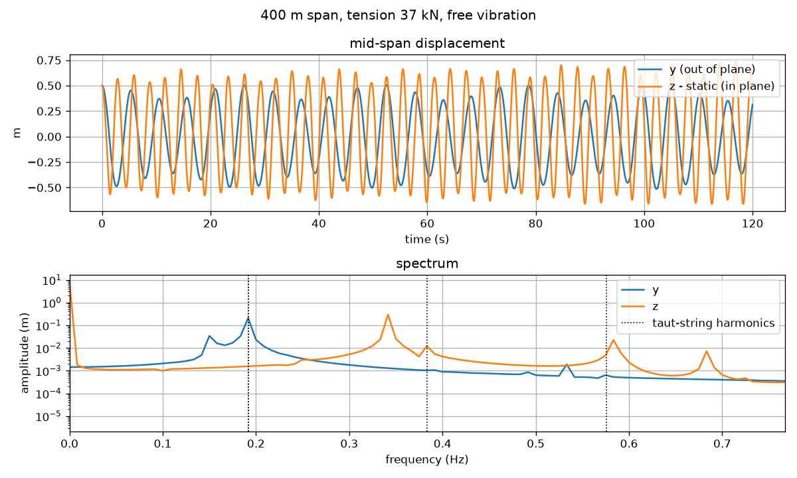

# slenderpy

Static and dynamic simulation of slender structures, overhead line cables
and beams, under their weight, wind and point excitations.

[](https://github.com/rte-france/pallas-slenderpy/actions/workflows/pytest.yml)
[](https://github.com/rte-france/pallas-slenderpy/actions/workflows/lint.yml)
[](https://rte-france.github.io/pallas-slenderpy/coverage/)
[](https://rte-france.github.io/pallas-slenderpy/)

[](LICENSE)



## Features

- Cable: catenary, parabolic and elastic closed forms; static shape under any
  load; time-domain solver (Lee and Perkins model); natural frequencies.
- Beam: static shape and dynamics of a tensioned beam, with a constant
  bending stiffness or a Bouc-Wen (hysteretic) bending law.
- Forces: gravity, point excitation, wind drag with constant or turbulent
  wind and a Reynolds-dependent drag coefficient, composed with `+`.
- Fatigue: rainflow cycle counting at a distance from a support.
- Stockbridge dampers (experimental).
- The former API is kept in `slenderpy.legacy`.

## Installation

```shell
python -m pip install "slenderpy @ git+https://github.com/rte-france/pallas-slenderpy"
```

or, with [uv](https://docs.astral.sh/uv/):

```shell
uv add "slenderpy @ git+https://github.com/rte-france/pallas-slenderpy"
```

## Quick start

Static shape of a 400 m span blown by a 25 m/s wind:

```python
import numpy as np

from slenderpy.cable import dynamic
from slenderpy.cable.static import shape
from slenderpy.components import Conductor, Span
from slenderpy.force.wind import ConstantWind, WindDrag

conductor = Conductor(mass=1.571, diameter=0.0313, axial_stiffness=3.76e07)
span = Span(length=400.0, tension=3.7e04)
x, y, z = dynamic.equilibrium(conductor, span, 201)

drag = WindDrag(diameter=conductor.diameter, wind=ConstantWind(25.0))
zeros = np.zeros_like(x)
windy = shape.solve(conductor, span, *drag(x, 0.0, y, z, zeros, zeros), 201)
print(f"out-of-plane deflection at mid-span: {windy[1].max():.2f} m")
```

## Documentation

- [Documentation](https://rte-france.github.io/pallas-slenderpy/): user
  guide, examples and API reference.
- [Examples](examples/): short scripts, each ending with its figures.
- [Coverage report](https://rte-france.github.io/pallas-slenderpy/coverage/).

## Development

```shell
uv sync --all-extras
uv run pytest test --cov=slenderpy --cov-report=term   # tests with coverage
uv run ruff check . && uv run ruff format --check .    # lint
```

Building the documentation is described in [CONTRIBUTING.md](CONTRIBUTING.md#documentation).

## Contributing and license

See [CONTRIBUTING.md](CONTRIBUTING.md) and the [code of conduct](code_of_conduct.md).
slenderpy is distributed under the [Mozilla Public License 2.0](LICENSE).
